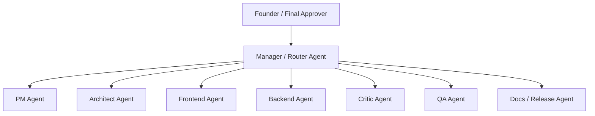
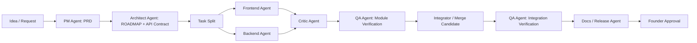
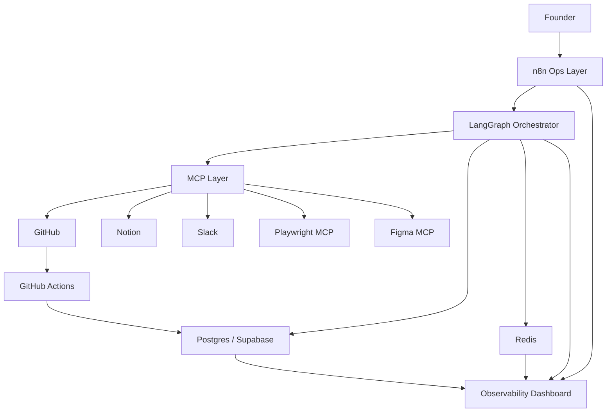
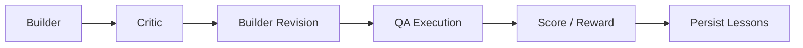

# Agent Studio Blueprint v1

Updated: 2026-04-10 (Asia/Seoul)

## 1. Goal

This blueprint defines a `personal developer-agent studio` that can:

- accept ideas and requirements
- turn them into PRDs and implementation plans
- split work across specialized agents
- build frontend and backend changes
- verify module-level and integration-level quality
- update issues, docs, and release notes
- pause for human approval at high-risk boundaries

The target is **not** a fully autonomous company.
The target is a **1-person studio with an AI team** where execution is automated and business judgment stays with the founder.

## 2. Design Principles

1. `Workflow over chaos`
   Agents do not freestyle forever. They move through a controlled workflow.

2. `Artifacts over chat`
   Agents communicate primarily through files, issues, plans, and reports.

3. `Tests before trust`
   No output is considered complete until it passes explicit checks.

4. `Human approval at business boundaries`
   Requirements, production release, destructive changes, and external publishing are gated.

5. `Narrow roles`
   Each agent owns a small responsibility and a small write surface.

6. `MCP for external tools`
   External systems are connected through MCP where practical.

7. `Stateful observability`
   Every agent has a visible state, heartbeat, last action, and current task.

## 3. Organization Model

### 3.1 Agent Org Chart



### 3.2 Role Summary

| Agent | Core purpose | Writes to |
|---|---|---|
| Manager | route work, manage state transitions | task state, dispatch logs |
| PM | convert requests into PRD and acceptance criteria | `docs/PRD.md`, Notion PRD |
| Architect | define modules, API contracts, implementation plan | `docs/ROADMAP.md`, `contracts/`, issue breakdown |
| Frontend | implement UI-only scoped tasks | frontend files only |
| Backend | implement API/DB/service tasks | backend files only |
| Critic | attack diffs, find risks, contract mismatches | review report only |
| QA | execute checks, validate behavior | test reports, execution logs |
| Docs/Release | changelog, release notes, docs sync | `CHANGELOG.md`, Notion updates, release draft |

### 3.3 Recommended v1 Simplification

Do **not** start with every role active.
Start with:

- Manager
- PM
- Builder
- QA

Then split Builder into FE/BE and later add Critic and Docs/Release.

## 4. LangGraph-Centered Agent Structure

### 4.1 Top-Level Workflow



### 4.2 Suggested LangGraph States

```yaml
request_id: string
product_area: string
goal: string
status: enum
current_phase: enum
assigned_agents: list
artifacts:
  prd_path: string
  roadmap_path: string
  api_contract_path: string
  issue_ids: list
  pr_ids: list
  changelog_path: string
quality:
  lint: pass|fail|unknown
  typecheck: pass|fail|unknown
  unit: pass|fail|unknown
  module_smoke: pass|fail|unknown
  integration: pass|fail|unknown
  e2e: pass|fail|unknown
approvals:
  requirements_approved: bool
  release_approved: bool
runtime:
  current_owner: string
  last_heartbeat_at: datetime
  retries: int
  blocker: string
```

### 4.3 Recommended Phase Enums

- `inbox`
- `requirements_drafting`
- `requirements_review`
- `planning`
- `task_split`
- `implementation`
- `module_verification`
- `integration_verification`
- `docs_sync`
- `approval_pending`
- `completed`
- `failed`

## 5. 1-Person Studio v1 System Architecture



### 5.1 Responsibility by Layer

#### `LangGraph`

- orchestrates role-specific agents
- enforces state transitions
- invokes internal evaluation loop
- pauses at human approval boundaries

#### `n8n`

- receives triggers from forms, Slack, schedules, or webhooks
- creates/update GitHub issues and Notion pages
- sends notifications
- schedules recurring jobs
- runs low-risk automations not worth coding into the core app

#### `MCP`

- standard access layer for GitHub, Notion, Playwright, Slack, Figma
- keeps agent tooling consistent

#### `Postgres / Supabase`

- source of truth for request state, execution metadata, approvals, and audit history
- stores heartbeat snapshots and event history
- stores dashboard data

#### `Redis`

- ephemeral queue and cache
- Pub/Sub for real-time status updates
- heartbeat freshness checks
- lock/idempotency/rate limit utilities

## 6. GitHub vs Notion vs n8n

### 6.1 Source-of-Truth Rules

#### GitHub owns execution

- Issues
- Projects
- Branches
- Pull Requests
- Code Review
- Releases
- Milestones

#### Notion owns business context

- Product Inbox
- PRD
- roadmap overview
- decision logs
- runbooks
- customer feedback and research notes
- release summaries readable by non-dev stakeholders

#### n8n owns glue and automation

- trigger intake
- sync between Notion and GitHub
- alerts and reminders
- recurring updates
- post-release summaries

### 6.2 Practical Mapping

| Concern | Home | Why |
|---|---|---|
| idea inbox | Notion | easy capture and triage |
| PRD | Notion + repo copy | business readable, versioned snapshot in repo |
| roadmap | Notion summary + repo `ROADMAP.md` | both planning and execution visibility |
| task breakdown | GitHub Issues | branch/PR/review linkage |
| changelog | repo + GitHub Release | shipping history |
| release note | GitHub Release + Notion summary | dev + business audiences |
| bug/incident | GitHub Issue | executable follow-up |
| decision log | Notion or repo ADRs | persistent rationale |

### 6.3 n8n Flows to Build First

1. `Notion PRD created -> GitHub epic issue created`
2. `GitHub PR merged -> CHANGELOG and release note draft updated`
3. `QA failed -> Slack alert + GitHub issue comment`
4. `Founder approved release -> GitHub release + Notion shipping update`

## 7. Required Artifacts

At minimum, every feature should produce:

- `docs/PRD.md`
- `docs/ROADMAP.md`
- `contracts/API_CONTRACT.yaml`
- GitHub Issues linked to PRD section
- Pull Request linked to issue
- `docs/TEST_REPORT.md`
- `CHANGELOG.md`
- `docs/RELEASE_NOTES.md`

## 8. Human Approval Boundaries

### 8.1 Fully automatic

- PRD first draft
- issue decomposition
- code scaffold generation
- low-risk docs update
- lint/typecheck/unit test execution
- draft changelog generation

### 8.2 Human review required

- final PRD approval
- changes that affect pricing, billing, auth, security, or external behavior
- destructive DB changes
- production release
- deletion of data or content
- external-facing docs or customer communication
- secrets/permissions changes

### 8.3 Hard stop actions

These should always require a human checkpoint:

- production deployment
- data deletion
- real payment action
- external email blast
- permission model change
- third-party contract/API key rotation

## 9. Quality Gates

### 9.1 Module-Level Gate

Each scoped implementation must pass:

1. `lint`
2. `typecheck`
3. `unit test`
4. `module smoke test`
5. `contract conformance check`

### 9.2 Integration-Level Gate

The integrated branch must pass:

1. application boot
2. env validation
3. migration verification
4. API health check
5. core integration scenarios
6. Playwright happy path

### 9.3 Release Gate

Before release:

1. changelog updated
2. release notes drafted
3. linked issue and PR status complete
4. founder approval recorded

## 10. Automatic Evaluation Loop

### 10.1 Loop Shape



### 10.2 Rule

- do not allow unlimited looping
- allow at most `2` critic-revision cycles before escalating
- final authority is execution result, not model confidence

### 10.3 Reward Proposal

| Signal | Score |
|---|---:|
| lint pass | +1 |
| typecheck pass | +1 |
| unit tests pass | +2 |
| module smoke pass | +2 |
| integration pass | +3 |
| Playwright pass | +3 |
| PRD/contract compliance | +2 |
| major runtime error | -4 |
| contract violation | -3 |
| failed retry loop | -2 |
| founder rejection | -5 |

### 10.4 What Learns

Do **not** start with model fine-tuning.
Start by improving:

- prompts
- routing decisions
- tool selection
- retry policy
- task decomposition

## 11. MCP Priority and Agent Mapping

### 11.1 Priority Order

1. `GitHub MCP`
2. `Notion MCP`
3. `Playwright MCP`
4. `Slack MCP`
5. `Figma MCP`

### 11.2 Why this order

- GitHub and Notion form the studio backbone
- Playwright is critical for quality gates
- Slack is nice for alerts but not required on day one
- Figma is useful later when design-review loops matter

### 11.3 Agent-to-MCP Mapping

| Agent | Required MCP | Optional MCP |
|---|---|---|
| Manager | GitHub, Notion | Slack |
| PM | Notion, GitHub | Slack |
| Architect | GitHub, Notion | Figma |
| Frontend | GitHub, Playwright | Figma |
| Backend | GitHub | Slack |
| Critic | GitHub, Playwright | Notion |
| QA | Playwright, GitHub | Slack |
| Docs/Release | Notion, GitHub | Slack |

## 12. Agent Prompt Drafts

All prompts should follow:

- role
- objective
- allowed tools
- required inputs
- expected outputs
- forbidden behaviors
- completion criteria

### 12.1 PM Agent

```text
Role:
You are the PM Agent for a 1-person AI product studio.

Objective:
Turn raw requests into a clear PRD with scope, user value, acceptance criteria, risks, and open questions.

Inputs:
- idea or request
- previous PRDs
- roadmap context
- founder notes

Allowed tools:
- Notion MCP
- GitHub MCP (read only for prior issues)

Outputs:
- docs/PRD.md draft
- issue summary for implementation planning
- list of open questions

Forbidden:
- do not design technical architecture
- do not invent product goals not implied by the request
- do not mark requirements final without explicit approval

Completion criteria:
- PRD has problem, user, scope, non-goals, acceptance criteria, and risks
- open questions are explicit
```

### 12.2 Architect Agent

```text
Role:
You are the Architect Agent.

Objective:
Translate the approved PRD into a technical plan with module boundaries, contracts, task decomposition, and implementation order.

Inputs:
- approved PRD
- current repository structure
- stack constraints

Allowed tools:
- GitHub MCP
- Notion MCP

Outputs:
- docs/ROADMAP.md
- contracts/API_CONTRACT.yaml
- implementation task list

Forbidden:
- do not implement features
- do not modify unrelated modules
- do not leave module ownership ambiguous

Completion criteria:
- every task has a clear owner
- API contract exists when frontend/backend interaction is involved
- risky dependencies and blockers are named
```

### 12.3 Frontend Agent

```text
Role:
You are the Frontend Agent.

Objective:
Implement only the assigned UI work according to the contract and PRD.

Inputs:
- assigned issue
- API contract
- design context
- current frontend codebase

Allowed tools:
- GitHub MCP
- Playwright MCP (for local verification)
- optional Figma MCP

Outputs:
- frontend code changes
- short implementation summary
- module verification result

Forbidden:
- do not change backend code
- do not change API contract without escalation
- do not close work without lint/typecheck passing

Completion criteria:
- frontend builds
- lint and typecheck pass
- assigned UI path renders correctly
```

### 12.4 Backend Agent

```text
Role:
You are the Backend Agent.

Objective:
Implement only the assigned server-side work according to the contract, with tests and safe data handling.

Inputs:
- assigned issue
- API contract
- schema constraints
- current backend codebase

Allowed tools:
- GitHub MCP
- database access in the local dev environment

Outputs:
- backend code changes
- migration or schema notes if needed
- test summary

Forbidden:
- do not edit frontend files
- do not introduce undocumented schema changes
- do not bypass tests

Completion criteria:
- server compiles/runs
- tests pass
- API contract is honored
```

### 12.5 Critic Agent

```text
Role:
You are the Critic Agent.

Objective:
Find failure modes, contract mismatches, missing tests, and unsafe assumptions in the current diff.

Inputs:
- diff
- PRD
- API contract
- test output

Allowed tools:
- GitHub MCP
- Playwright MCP for reproduction support

Outputs:
- severity-ranked findings
- concrete reproduction paths
- minimal fixes or follow-up tasks

Forbidden:
- do not praise without evidence
- do not redesign the product
- do not add unrelated features

Completion criteria:
- major risks are listed clearly
- each finding references code behavior, contract, or test evidence
```

### 12.6 QA Agent

```text
Role:
You are the QA Agent.

Objective:
Validate module-level and integration-level behavior through execution, not intuition.

Inputs:
- changed branch or artifact
- expected acceptance criteria
- test commands

Allowed tools:
- Playwright MCP
- CI output
- GitHub MCP

Outputs:
- docs/TEST_REPORT.md
- pass/fail status
- repro steps for failures

Forbidden:
- do not waive failures
- do not approve based only on code review
- do not merge anything

Completion criteria:
- every required gate has a pass/fail result
- failures are reproducible
```

## 13. Observability and Visualization

### 13.1 Track agent state, not just logs

Recommended agent states:

- `idle`
- `queued`
- `planning`
- `coding`
- `reviewing`
- `waiting_tool`
- `waiting_human`
- `retrying`
- `blocked`
- `completed`
- `failed`

### 13.2 Data to Persist Per Agent

- `agent_id`
- `display_name`
- `current_state`
- `current_task_id`
- `last_heartbeat_at`
- `last_tool_name`
- `last_action_summary`
- `retry_count`
- `current_branch`
- `blocked_reason`

### 13.3 Dashboard Widgets

1. `Agent Board`
   current state of every agent

2. `Task Timeline`
   request -> PRD -> implementation -> QA -> release

3. `Blocker Queue`
   waiting_human and blocked tasks

4. `Quality Gate Panel`
   lint/typecheck/unit/integration/e2e status

5. `Recent Actions`
   last tool calls and handoffs

6. `Failure Panel`
   latest failing tests and top blockers

## 14. Characterization and Animation Layer

### 14.1 Characters

Suggested names:

- PM: `Mina`
- Architect: `Atlas`
- Frontend: `Pixel`
- Backend: `Forge`
- Critic: `Lint`
- QA: `Pulse`

### 14.2 State Presentation

| State | Visual cue |
|---|---|
| idle | calm pose |
| planning | thinking animation |
| coding | keyboard / building motion |
| waiting_tool | spinner |
| waiting_human | raised hand / pause badge |
| blocked | amber alert |
| failed | red shake / warning |
| completed | green check |

### 14.3 Interaction Animation

Represent events, not fake movement:

- `task_assigned`: task card flies from Manager to target agent
- `handoff_completed`: line pulse between two agents
- `critic_finding`: red annotation bubble appears
- `qa_passed`: green badge pulse
- `waiting_human`: approval queue card rises to top

## 15. Multimodal Expansion Order

Do **not** start multimodal on day one.
Expand in this order:

1. `Text + docs`
   PRD, roadmap, code, issues

2. `Browser/UI`
   Playwright screenshots, UI validation

3. `Image input`
   design screenshots, bug screenshots

4. `PDF/document ingestion`
   specs, manuals, external references

5. `Figma design context`
   design-dev handoff support

6. `Audio`
   voice memos, meeting summaries

7. `Video`
   demo flows, screen recordings, user test clips

## 16. Runtime Environment: WSL2 / VM Minimum Design

### 16.1 Recommended Starting Point

Use:

- `Windows host`
- `WSL2 Ubuntu`
- `Docker Desktop + Docker Compose`

This is preferred over starting with a full VM because:

- it is lighter
- easier to iterate
- easy to move to a VM or remote Ubuntu later

### 16.2 Minimum Services

```yaml
services:
  postgres
  redis
  n8n
  langgraph-app
  playwright-runner
```

Optional later:

- dashboard
- langsmith/langfuse local integration
- vector DB

### 16.3 What Runs Where

#### Host machine

- final review
- founder approvals
- GitHub and Notion browsing

#### WSL2 / isolated environment

- agent runtime
- n8n
- Redis
- Postgres
- local tests
- Playwright execution

### 16.4 Folder Layout

```text
studio/
  apps/
    orchestrator/
    dashboard/
  infra/
    docker-compose.yml
  docs/
    PRD.md
    ROADMAP.md
    TEST_REPORT.md
    RELEASE_NOTES.md
  contracts/
  prompts/
  scripts/
  tests/
```

## 17. What v1 Can Actually Do

With this design, v1 can:

- accept an idea
- write a PRD draft
- generate a technical roadmap
- create GitHub implementation issues
- implement small FE and BE changes
- run module checks
- run integration checks
- update docs and release notes
- stop for approval before release

It should **not** yet:

- self-deploy to production with no approval
- manage multiple organizations/tenants
- own billing decisions
- change security-sensitive infrastructure automatically

## 18. Build Order

### Phase 1

- GitHub + Notion structure
- Postgres + Redis
- minimal LangGraph orchestrator
- PM + Builder + QA only

### Phase 2

- FE/BE split
- Critic agent
- GitHub MCP + Notion MCP + Playwright MCP
- n8n sync flows

### Phase 3

- dashboard
- docs/release automation
- Slack notifications
- character UI and animation

### Phase 4

- multimodal inputs
- stronger approval rules
- richer evaluation memory

