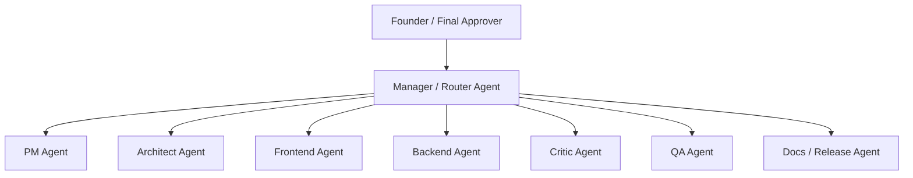
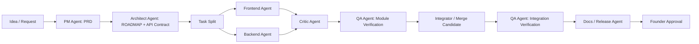
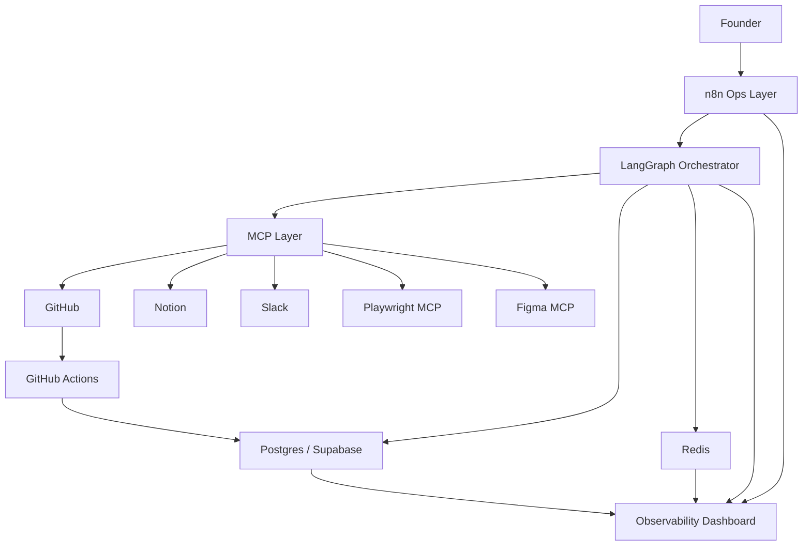
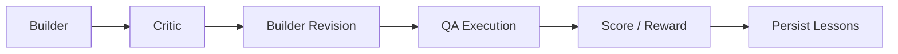

# Agent Studio Master Plan

Updated: 2026-04-10 (Asia/Seoul)

---

## A. Current Goal

Build a `personal developer-agent studio` first, then expand it toward a business-grade and later enterprise-capable system.

The immediate target is:

- a 1-person studio
- with multiple specialized AI agents
- running in a controlled workflow
- with quality gates
- with docs, issue tracking, versioning, and release discipline
- with human approval at high-risk boundaries

This is **not** a fully autonomous company.
It is an **AI execution studio** where the founder keeps control of direction and approvals.

---

## B. Design Principles

1. `Workflow over chaos`
   Agents operate within a controlled graph, not endless freeform conversation.

2. `Artifacts over chat`
   PRDs, roadmaps, contracts, issues, reports, and changelogs are the main communication medium.

3. `Tests before trust`
   Code and outputs are not accepted until explicit checks pass.

4. `Human approval at business boundaries`
   Requirements, production release, destructive changes, and external publishing are gated.

5. `Narrow roles`
   Each agent owns a small scope and a small write surface.

6. `MCP for external tools`
   External systems are connected through MCP where practical.

7. `Stateful observability`
   Every agent should expose state, heartbeat, task, last action, and blocker.

---

## C. Organization Model

### C.1 Agent Org Chart



### C.2 Role Summary

| Agent | Core purpose | Writes to |
|---|---|---|
| Manager | route work, manage state transitions | task state, dispatch logs |
| PM | convert requests into PRD and acceptance criteria | `docs/PRD.md`, Notion PRD |
| Architect | define modules, API contracts, implementation plan | `docs/ROADMAP.md`, `contracts/`, issue breakdown |
| Frontend | implement UI-only scoped tasks | frontend files only |
| Backend | implement API/DB/service tasks | backend files only |
| Critic | attack diffs, find risks, contract mismatches | review report only |
| QA | execute checks, validate behavior | test reports, execution logs |
| Docs/Release | changelog, release notes, docs sync | `CHANGELOG.md`, Notion updates, release draft |

### C.3 Recommended v1 Simplification

Start with:

- Manager
- PM
- Builder
- QA

Then split Builder into FE/BE and later add Critic and Docs/Release.

---

## D. LangGraph-Centered Agent Structure

### D.1 Top-Level Workflow



### D.2 Suggested LangGraph State

```yaml
request_id: string
product_area: string
goal: string
status: enum
current_phase: enum
assigned_agents: list
artifacts:
  prd_path: string
  roadmap_path: string
  api_contract_path: string
  issue_ids: list
  pr_ids: list
  changelog_path: string
quality:
  lint: pass|fail|unknown
  typecheck: pass|fail|unknown
  unit: pass|fail|unknown
  module_smoke: pass|fail|unknown
  integration: pass|fail|unknown
  e2e: pass|fail|unknown
approvals:
  requirements_approved: bool
  release_approved: bool
runtime:
  current_owner: string
  last_heartbeat_at: datetime
  retries: int
  blocker: string
```

### D.3 Recommended Phases

- `inbox`
- `requirements_drafting`
- `requirements_review`
- `planning`
- `task_split`
- `implementation`
- `module_verification`
- `integration_verification`
- `docs_sync`
- `approval_pending`
- `completed`
- `failed`

---

## E. 1-Person Studio v1 System Architecture



### E.1 Layer Responsibilities

#### `LangGraph`

- agent orchestration
- state transitions
- retry loops
- human approval interruptions

#### `n8n`

- trigger intake
- alerts and reminders
- cross-tool sync
- recurring workflows

#### `MCP`

- tool access layer for GitHub, Notion, Playwright, Slack, Figma

#### `Postgres / Supabase`

- source of truth for task state, approvals, execution metadata, audit history

#### `Redis`

- ephemeral queue and cache
- Pub/Sub for real-time updates
- heartbeat freshness, lock/idempotency helpers

---

## F. GitHub vs Notion vs n8n

### F.1 Source-of-Truth Rules

#### GitHub owns execution

- Issues
- Projects
- Branches
- Pull Requests
- Reviews
- Milestones
- Releases

#### Notion owns business context

- Product Inbox
- PRD
- Roadmap overview
- Decision logs
- Runbooks
- Feedback/research
- Business-facing release summaries

#### n8n owns glue and automation

- request intake
- PRD/issue sync
- reminders
- status notifications
- post-release docs sync

### F.2 Practical Mapping

| Concern | Home | Why |
|---|---|---|
| idea inbox | Notion | easy capture and triage |
| PRD | Notion + repo copy | readable + versioned |
| roadmap | Notion summary + repo `ROADMAP.md` | planning + execution visibility |
| task breakdown | GitHub Issues | branch/PR linkage |
| changelog | repo + GitHub Release | shipping history |
| release note | GitHub Release + Notion summary | dev + business audiences |
| bug/incident | GitHub Issue | executable follow-up |
| decision log | Notion or repo ADRs | persistent rationale |

### F.3 n8n Flows to Build First

1. `Notion PRD created -> GitHub epic issue created`
2. `GitHub PR merged -> CHANGELOG and release note draft updated`
3. `QA failed -> Slack alert + GitHub issue comment`
4. `Founder approved release -> GitHub release + Notion shipping update`

---

## G. Required Artifacts

Every serious feature should produce:

- `docs/PRD.md`
- `docs/ROADMAP.md`
- `contracts/API_CONTRACT.yaml`
- GitHub Issues linked to PRD section
- Pull Request linked to issue
- `docs/TEST_REPORT.md`
- `CHANGELOG.md`
- `docs/RELEASE_NOTES.md`

---

## H. Human Approval Boundaries

### H.1 Fully automatic

- PRD first draft
- issue decomposition
- code scaffold generation
- low-risk docs updates
- lint/typecheck/unit test execution
- draft changelog generation

### H.2 Human review required

- final PRD approval
- pricing, billing, auth, security, or external behavior changes
- destructive DB changes
- production release
- deletion of data or content
- external-facing docs or customer communication
- secrets/permissions changes

### H.3 Hard-stop actions

- production deployment
- data deletion
- payment actions
- external email blast
- permission model changes
- third-party credential rotation

---

## I. Quality Gates

### I.1 Module-Level Gate

Every scoped implementation must pass:

1. `lint`
2. `typecheck`
3. `unit test`
4. `module smoke test`
5. `contract conformance check`

### I.2 Integration-Level Gate

Integrated work must pass:

1. application boot
2. env validation
3. migration verification
4. API health check
5. integration scenarios
6. Playwright happy path

### I.3 Release Gate

Before release:

1. changelog updated
2. release notes drafted
3. linked issue and PR status complete
4. founder approval recorded

---

## J. Automatic Evaluation Loop

### J.1 Loop Shape



### J.2 Loop Rules

- maximum `2` critic-revision cycles before escalation
- execution result beats model confidence

### J.3 Reward Proposal

| Signal | Score |
|---|---:|
| lint pass | +1 |
| typecheck pass | +1 |
| unit tests pass | +2 |
| module smoke pass | +2 |
| integration pass | +3 |
| Playwright pass | +3 |
| PRD/contract compliance | +2 |
| major runtime error | -4 |
| contract violation | -3 |
| failed retry loop | -2 |
| founder rejection | -5 |

### J.4 What Learns First

Do not start with model fine-tuning.
Improve first:

- prompts
- routing
- tool selection
- retry policy
- task decomposition

---

## K. MCP Priority and Agent Mapping

### K.1 Priority Order

1. `GitHub MCP`
2. `Notion MCP`
3. `Playwright MCP`
4. `Slack MCP`
5. `Figma MCP`

### K.2 Agent-to-MCP Mapping

| Agent | Required MCP | Optional MCP |
|---|---|---|
| Manager | GitHub, Notion | Slack |
| PM | Notion, GitHub | Slack |
| Architect | GitHub, Notion | Figma |
| Frontend | GitHub, Playwright | Figma |
| Backend | GitHub | Slack |
| Critic | GitHub, Playwright | Notion |
| QA | Playwright, GitHub | Slack |
| Docs/Release | Notion, GitHub | Slack |

---

## L. Agent Prompt Drafts

All prompts should specify:

- role
- objective
- allowed tools
- required inputs
- expected outputs
- forbidden behaviors
- completion criteria

### L.1 PM Agent

```text
Role:
You are the PM Agent for a 1-person AI product studio.

Objective:
Turn raw requests into a clear PRD with scope, user value, acceptance criteria, risks, and open questions.

Inputs:
- idea or request
- previous PRDs
- roadmap context
- founder notes

Allowed tools:
- Notion MCP
- GitHub MCP (read only for prior issues)

Outputs:
- docs/PRD.md draft
- issue summary for implementation planning
- list of open questions

Forbidden:
- do not design technical architecture
- do not invent product goals not implied by the request
- do not mark requirements final without explicit approval

Completion criteria:
- PRD has problem, user, scope, non-goals, acceptance criteria, and risks
- open questions are explicit
```

### L.2 Architect Agent

```text
Role:
You are the Architect Agent.

Objective:
Translate the approved PRD into a technical plan with module boundaries, contracts, task decomposition, and implementation order.

Inputs:
- approved PRD
- current repository structure
- stack constraints

Allowed tools:
- GitHub MCP
- Notion MCP

Outputs:
- docs/ROADMAP.md
- contracts/API_CONTRACT.yaml
- implementation task list

Forbidden:
- do not implement features
- do not modify unrelated modules
- do not leave module ownership ambiguous

Completion criteria:
- every task has a clear owner
- API contract exists when frontend/backend interaction is involved
- risky dependencies and blockers are named
```

### L.3 Frontend Agent

```text
Role:
You are the Frontend Agent.

Objective:
Implement only the assigned UI work according to the contract and PRD.

Inputs:
- assigned issue
- API contract
- design context
- current frontend codebase

Allowed tools:
- GitHub MCP
- Playwright MCP (for local verification)
- optional Figma MCP

Outputs:
- frontend code changes
- short implementation summary
- module verification result

Forbidden:
- do not change backend code
- do not change API contract without escalation
- do not close work without lint/typecheck passing

Completion criteria:
- frontend builds
- lint and typecheck pass
- assigned UI path renders correctly
```

### L.4 Backend Agent

```text
Role:
You are the Backend Agent.

Objective:
Implement only the assigned server-side work according to the contract, with tests and safe data handling.

Inputs:
- assigned issue
- API contract
- schema constraints
- current backend codebase

Allowed tools:
- GitHub MCP
- database access in the local dev environment

Outputs:
- backend code changes
- migration or schema notes if needed
- test summary

Forbidden:
- do not edit frontend files
- do not introduce undocumented schema changes
- do not bypass tests

Completion criteria:
- server compiles/runs
- tests pass
- API contract is honored
```

### L.5 Critic Agent

```text
Role:
You are the Critic Agent.

Objective:
Find failure modes, contract mismatches, missing tests, and unsafe assumptions in the current diff.

Inputs:
- diff
- PRD
- API contract
- test output

Allowed tools:
- GitHub MCP
- Playwright MCP for reproduction support

Outputs:
- severity-ranked findings
- concrete reproduction paths
- minimal fixes or follow-up tasks

Forbidden:
- do not praise without evidence
- do not redesign the product
- do not add unrelated features

Completion criteria:
- major risks are listed clearly
- each finding references code behavior, contract, or test evidence
```

### L.6 QA Agent

```text
Role:
You are the QA Agent.

Objective:
Validate module-level and integration-level behavior through execution, not intuition.

Inputs:
- changed branch or artifact
- expected acceptance criteria
- test commands

Allowed tools:
- Playwright MCP
- CI output
- GitHub MCP

Outputs:
- docs/TEST_REPORT.md
- pass/fail status
- repro steps for failures

Forbidden:
- do not waive failures
- do not approve based only on code review
- do not merge anything

Completion criteria:
- every required gate has a pass/fail result
- failures are reproducible
```

---

## M. Observability and Visualization

### M.1 Track agent state, not just logs

Recommended states:

- `idle`
- `queued`
- `planning`
- `coding`
- `reviewing`
- `waiting_tool`
- `waiting_human`
- `retrying`
- `blocked`
- `completed`
- `failed`

### M.2 Data to Persist Per Agent

- `agent_id`
- `display_name`
- `current_state`
- `current_task_id`
- `last_heartbeat_at`
- `last_tool_name`
- `last_action_summary`
- `retry_count`
- `current_branch`
- `blocked_reason`

### M.3 Dashboard Widgets

1. `Agent Board`
2. `Task Timeline`
3. `Blocker Queue`
4. `Quality Gate Panel`
5. `Recent Actions`
6. `Failure Panel`

### M.4 Character Layer

Suggested names:

- PM: `Mina`
- Architect: `Atlas`
- Frontend: `Pixel`
- Backend: `Forge`
- Critic: `Lint`
- QA: `Pulse`

### M.5 Animation Events

- `task_assigned`
- `handoff_completed`
- `critic_finding`
- `qa_passed`
- `waiting_human`

Animation should be driven by real runtime events, not fake movement.

---

## N. Multimodal Expansion Order

Do not start multimodal on day one.
Expand in this order:

1. `Text + docs`
2. `Browser/UI`
3. `Image input`
4. `PDF/document ingestion`
5. `Figma design context`
6. `Audio`
7. `Video`

---

## O. Runtime Environment: WSL2 / VM Minimum Design

### O.1 Recommended Starting Point

Use:

- `Windows host`
- `WSL2 Ubuntu`
- `Docker Desktop + Docker Compose`

### O.2 Minimum Services

```yaml
services:
  postgres
  redis
  n8n
  langgraph-app
  playwright-runner
```

### O.3 What Runs Where

#### Host machine

- final review
- founder approvals
- GitHub and Notion browsing

#### WSL2 / isolated environment

- agent runtime
- n8n
- Redis
- Postgres
- local tests
- Playwright execution

### O.4 Suggested Folder Layout

```text
studio/
  apps/
    orchestrator/
    dashboard/
  infra/
    docker-compose.yml
  docs/
    PRD.md
    ROADMAP.md
    TEST_REPORT.md
    RELEASE_NOTES.md
  contracts/
  prompts/
  scripts/
  tests/
```

---

## P. What v1 Can Actually Do

With this design, v1 can:

- accept an idea
- write a PRD draft
- generate a roadmap
- create GitHub issues
- implement small FE and BE changes
- run module and integration checks
- update docs and release notes
- stop for approval before release

It should not yet:

- self-deploy to production with no approval
- manage multiple organizations/tenants
- own billing decisions
- change sensitive infrastructure automatically

---

## Q. Build Order

### Phase 1

- GitHub + Notion structure
- Postgres + Redis
- minimal LangGraph orchestrator
- PM + Builder + QA only

### Phase 2

- FE/BE split
- Critic agent
- GitHub MCP + Notion MCP + Playwright MCP
- n8n sync flows

### Phase 3

- dashboard
- docs/release automation
- Slack notifications
- character UI and animation

### Phase 4

- multimodal inputs
- stronger approval rules
- richer evaluation memory

---

## R. TODO Backlog

### R.1 Core design

- 프론트/백/PM/기획 agent 구조를 LangGraph 기준으로 더 구체 설계
- 1인회사용 agent 조직도를 개발회사 버전으로 더 구체화
- 1인 스튜디오형 AI 개발 시스템 v1 아키텍처를 구현 단위로 세분화
- 어디까지 자동으로 맡기고 어디서 반드시 사람 승인을 넣어야 하는지 경계선 상세화

### R.2 Workflow and docs

- GitHub에는 뭘 두고 Notion에는 뭘 두고 n8n이 둘을 어떻게 연결할지 실무형 세부안 작성
- 문서/산출물 규약 실제 템플릿 만들기: `PRD.md`, `ROADMAP.md`, `API_CONTRACT.yaml`, `TEST_REPORT.md`, `CHANGELOG.md`, `RELEASE_NOTES.md`
- 버전관리, 업데이트 이력, 이슈관리, 요구사항 명세 흐름을 실제 운영 절차로 정리

### R.3 Agent execution and prompts

- 어떤 MCP 서버를 우선순위로 붙일지와 agent별 MCP 매핑 상세화
- `PM / Architect / FE / BE / Critic / QA` 6개 agent용 프롬프트 실전형 버전업
- 개발 agent 2-AI 보완 구조 상세화: `Builder + Critic + Verifier`
- 개발 에이전트용 reward/score 설계 상세화
- 자동 평가 루프 설계 고도화: `생성 -> 비평 -> 수정 -> 실행검증 -> 점수기록`

### R.4 Quality gates

- 개인형 개발 에이전트 v1 품질 게이트 설계도 세부화
- 모듈별 구동 확인 규칙 상세 정의
- 통합 시 구동 확인 규칙 상세 정의
- 테스트 전략 정의: `lint`, `typecheck`, `unit`, `smoke`, `integration`, `Playwright E2E`

### R.5 Runtime and environment

- 개인형 개발 에이전트 스튜디오를 VM/WSL2에 띄우는 최소 구성 상세화
- `WSL2 Ubuntu + Docker Compose` 기준 실제 실행 환경 상세화
- 최소 컨테이너 구성 구체화: `LangGraph app`, `n8n`, `Redis`, `Postgres`, `Playwright runner`
- 상태/heartbeat/event 저장 구조 설계

### R.6 Visualization and monitoring

- AI 에이전트 상태 시각화 구조 설계
- agent들을 캐릭터라이징하는 UI 콘셉트 설계
- agent 상호작용 애니메이션 구조 설계
- 1인 스튜디오형 agent 관제 대시보드 위젯 설계

### R.7 Expansion

- 멀티모달로 확장할 때 어떤 입력 채널을 어떤 순서로 붙일지 상세화
- 개인형 -> 팀형 -> 엔터프라이즈형 확장 로드맵 정리

